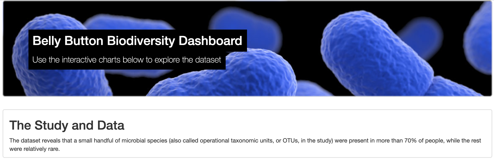
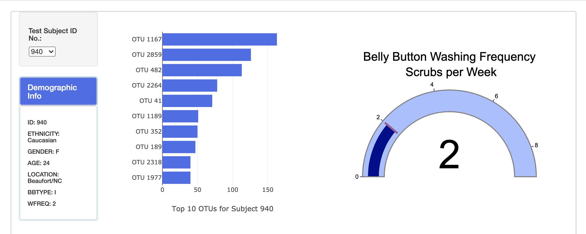
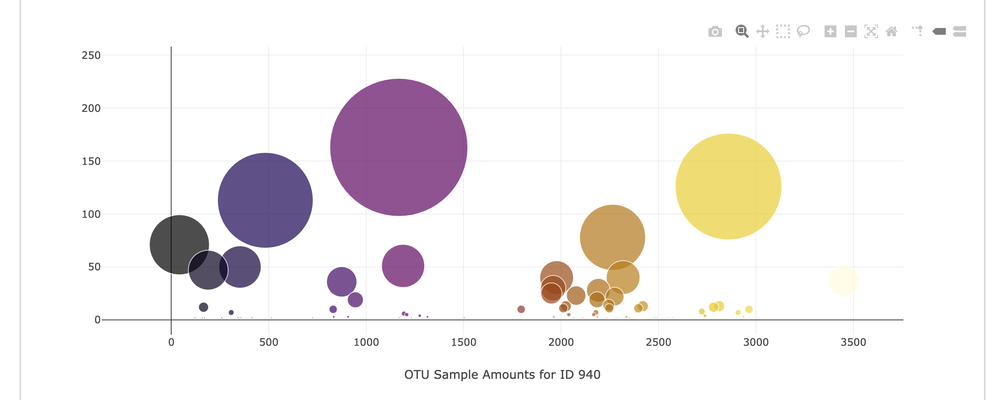

# D3-Biodiversity-Dashboard
An interactive dashboard to explore the Belly Button Biodiversity dataset, 
which catalogs the microbes that colonize human navels. 
The dataset reveals that a small handful of microbial species
(also called operational taxonomic units, or OTUs, in the study) were present
in more than 70% of people, while the rest were relatively rare. 
---
[Visit my site HERE!](https://gitgranthub.github.io/D3-Biodiversity-Dashboard/)
* D3.js
* Plot.ly
* Javascript
* HTML

----
* I've included a brief description of the **study** below the jumbotron heading. The background image in the jumbotron is ©CDC and for public use. I've used custom css throughout the page.

----
----

* Data for each subject is easily selected using the dropdown menu. I modified the gauge to be what I thought was very readable. 

----
----

* The Plot.ly bubble chart also update based on the subject selected.

----
----
